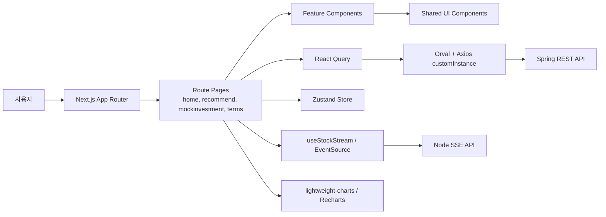

# Jumoney Frontend

Jumoney Frontend는 투자 초보자가 자신의 투자 성향을 파악하고, 추천 종목을 확인하며, 모의투자와 주식 용어 학습까지 이어갈 수 있도록 만든 모바일 중심 투자 교육 서비스의 프론트엔드입니다.

> 본 서비스는 투자 학습과 모의투자 경험을 위한 프로젝트이며, 실제 투자 자문 서비스가 아닙니다.

## 핵심 요약

| 구분        | 내용                                                                                            |
| ----------- | ----------------------------------------------------------------------------------------------- |
| 담당 영역   | `Jumoney-FE` 프론트엔드 애플리케이션                                                            |
| 서비스 형태 | 모바일 앱 경험에 가까운 투자 교육/모의투자 웹 서비스                                            |
| 프레임워크  | Next.js 16 App Router, React 19, TypeScript                                                     |
| 상태 관리   | TanStack React Query, Zustand, localStorage                                                     |
| API 연동    | Orval 생성 API client, Axios interceptor, refresh token 재발급                                  |
| 시각화      | lightweight-charts, Recharts                                                                    |
| UX 구현     | Framer Motion, Vaul Drawer, 하단 탭바, 고정 CTA, 설문 플로우                                    |
| 주요 기능   | 투자 성향 설문, 종목 추천, 거장 전략 추천, 백테스트 차트, 모의투자, 실시간 시세, 주식 용어 학습 |

## 프론트엔드에서 보여주는 역량

- Next.js App Router 기반으로 홈, 추천, 모의투자, 포트폴리오, 주식 용어 학습 화면을 라우트 단위로 설계했습니다.
- React Query와 Orval 생성 훅을 사용해 서버 상태를 타입 기반으로 다루고, Axios interceptor로 access token 갱신 흐름을 공통화했습니다.
- 설문 진행 상태처럼 여러 페이지를 거치는 클라이언트 상태는 Zustand로 분리해 라우트 이동 중에도 사용자의 선택을 유지했습니다.
- Node SSE 스트림을 EventSource로 구독해 종목 상세 화면과 보유 종목 평가금액에 실시간 가격 변화를 반영했습니다.
- lightweight-charts를 활용해 기간별 차트와 거장 추천 백테스트 검증 차트를 구현했습니다.
- 모바일 화면을 기준으로 하단 탭바, 온보딩, 바텀시트, 고정 하단 버튼, 드래그 가능한 섹터 선택 UI를 구성했습니다.
- 투자 초보자가 이해할 수 있도록 금융 지표 라벨, 추천 조건, 종목 카드, 뉴스 로딩 화면을 사용자 친화적인 문구와 시각 흐름으로 정리했습니다.

## 기술 스택

| 영역         | 기술                                 | 적용 방식                                                       |
| ------------ | ------------------------------------ | --------------------------------------------------------------- |
| Framework    | Next.js 16 App Router                | `src/app` 라우팅, route group, OAuth callback, main layout 구성 |
| Language     | TypeScript                           | API 응답 타입, 컴포넌트 props, 도메인 매핑 타입 관리            |
| UI Runtime   | React 19                             | client component, hook 기반 상태/이벤트 처리                    |
| Server State | TanStack React Query v5              | Orval 생성 query/mutation hook, 캐싱, refetch, placeholder data |
| API Client   | Axios, Orval 8                       | Swagger 기반 API 함수/타입 자동 생성, custom mutator 적용       |
| Client State | Zustand                              | 설문 선택값, 추천 결과, 프로필 상태 유지                        |
| Styling      | Tailwind CSS 4                       | 디자인 토큰, 모바일 레이아웃, 상태별 색상                       |
| UI Primitive | shadcn/ui style components, Radix UI | Button, ToggleGroup, Progress, Drawer 등                        |
| Animation    | Framer Motion                        | 설문 선택, 페이지 진입, 로딩 카드, carousel, drag UI            |
| Chart        | lightweight-charts, Recharts         | 종목 차트, 백테스트 검증 차트, 랭킹/포트폴리오 차트             |
| Forms        | React Hook Form, Zod                 | 입력 검증과 form schema 확장 기반                               |
| Mocking      | MSW generated by Orval               | API mock handler 생성 기반                                      |
| Quality      | ESLint, Prettier, Husky, lint-staged | 정적 검사와 포맷팅                                              |

## 프론트엔드 아키텍처



### 상태 관리 원칙

| 상태 유형           | 사용 기술                       | 예시                                                      |
| ------------------- | ------------------------------- | --------------------------------------------------------- |
| 서버 상태           | React Query                     | 추천 결과 조회, 모의투자 계좌, 종목 상세, 차트, 용어 목록 |
| API 타입            | Orval generated model           | Swagger 기반 요청/응답 타입                               |
| 인증 상태           | Axios interceptor, localStorage | access token 저장, 401 발생 시 refresh 재시도             |
| 페이지 간 임시 상태 | Zustand                         | 오늘의 호주머니 설문 선택값, 추천 결과                    |
| UI 로컬 상태        | `useState`, `useMemo`, `useRef` | 탭, 토글, 바텀시트, 검색어, carousel 위치                 |
| 방문 여부           | localStorage                    | 모의투자 온보딩 최초 진입 분기                            |

## 주요 화면과 기능

### 1. 인트로와 인증

사용자가 서비스의 목적을 이해하고 카카오 로그인으로 진입할 수 있는 첫 흐름입니다.

- 온보딩 카드와 단계형 인트로 화면
- 카카오 로그인 버튼
- OAuth callback 처리
- access token 저장
- refresh token 기반 자동 재발급
- 로그인 실패 또는 refresh 실패 시 메인 화면으로 이동

관련 라우트:

```text
/
/intro
/oauth/kakao/callback
```

관련 파일:

```text
Jumoney-FE/src/app/page.tsx
Jumoney-FE/src/app/intro/page.tsx
Jumoney-FE/src/app/oauth/kakao/callback/page.tsx
Jumoney-FE/src/api/custom-instance.ts
```

### 2. 홈

홈은 사용자가 서비스에 재진입했을 때 오늘의 학습, 모의투자 현황, 랭킹을 빠르게 확인하는 화면입니다.

- 오늘의 주식 용어 카드
- 최신 뉴스 카드
- 내 모의투자 계좌 요약
- 대표 보유 종목 차트
- 전체 랭킹과 거장별 랭킹
- 프로필 모달

프론트엔드 관점의 구현 포인트:

- 홈 카드별 API 호출을 분리해 무거운 차트 데이터가 첫 렌더링을 막지 않도록 구성했습니다.
- 랭킹, 오늘의 용어, 모의투자 요약처럼 성격이 다른 데이터를 각각 독립 컴포넌트로 나누었습니다.
- 랭킹 프로필과 포트폴리오 차트는 모바일 화면에서 빠르게 스캔할 수 있도록 카드형 UI로 구성했습니다.

관련 라우트:

```text
/home
```

관련 파일:

```text
Jumoney-FE/src/app/(main)/home/page.tsx
Jumoney-FE/src/features/home/todayTermCard.tsx
Jumoney-FE/src/features/home/todayNewsCard.tsx
Jumoney-FE/src/features/home/mockInvestment.tsx
Jumoney-FE/src/features/home/rankingChart.tsx
Jumoney-FE/src/features/home/rankProfile.tsx
```

### 3. 오늘의 호주머니

오늘의 호주머니는 사용자의 투자 성향을 3단계 설문으로 받고, 추천 결과를 보여주는 핵심 플로우입니다.

화면 흐름:

```text
/recommend?tab=left
/recommend/surveyfirst
/recommend/surveysecond
/recommend/surveythird
/recommend/surveyloading
/recommend/surveyresult
/recommend/testaccount
```

구현 포인트:

- 설문 단계가 여러 라우트로 분리되어 있어도 Zustand store로 선택값을 유지합니다.
- 투자 목적에 따라 선택 가능한 위험도와 투자 기간을 제한합니다.
- 2단계 위험도 선택은 세로 슬라이더와 감정 아이콘으로 구성했습니다.
- Framer Motion으로 선택 반응, 페이지 전환, 로딩 카드 순환 애니메이션을 적용했습니다.
- 로딩 화면에서는 추천 API 요청과 최소 로딩 시간을 함께 관리해 결과 화면으로 너무 급격히 전환되지 않도록 했습니다.
- 오늘 뉴스 API를 함께 호출해 사용자가 추천이 시장 뉴스와 연결되어 있다는 맥락을 이해할 수 있도록 했습니다.

설문 상태:

```text
purpose             # 투자 목적
riskValue           # 위험 감수 값: 0, 33, 66, 100
period              # 투자 기간
recommendationData  # 추천 결과
```

관련 파일:

```text
Jumoney-FE/src/store/surveyStore.ts
Jumoney-FE/src/constants/surveyConstraints.ts
Jumoney-FE/src/app/(main)/recommend/surveyfirst/page.tsx
Jumoney-FE/src/app/(main)/recommend/surveysecond/page.tsx
Jumoney-FE/src/app/(main)/recommend/surveythird/page.tsx
Jumoney-FE/src/app/(main)/recommend/surveyloading/page.tsx
Jumoney-FE/src/app/(main)/recommend/surveyresult/page.tsx
Jumoney-FE/src/features/recommend/recommendSurveyIntro.tsx
```

### 4. 거장의 선택

거장의 선택은 투자 거장별 전략과 조건을 사용자가 탐색하고, 추천 종목과 검증 차트를 확인하는 기능입니다.

화면 흐름:

```text
/recommend?tab=right
/recommend/[masterId]
/recommend/[masterId]/testaccount
/recommend/[masterId]/[verifyId]
```

구현 포인트:

- 추천 진입 페이지에서 오늘의 호주머니와 거장의 선택을 query string 기반 탭으로 전환합니다.
- 거장별 조건 선택, 섹터 선택, 추천 결과 카드를 한 흐름으로 구성했습니다.
- 추천 결과 카드에서 검증 버튼을 누르면 선택 조건과 섹터를 query string으로 전달해 백테스트 화면에서 재사용합니다.
- lightweight-charts로 백테스트 결과를 차트 위에 표시하고, 조건 만족 여부를 시각적으로 확인할 수 있게 구성했습니다.
- 거장별 모의 운용 계정 화면으로 이동할 수 있는 floating button을 제공합니다.

관련 파일:

```text
Jumoney-FE/src/app/(main)/recommend/page.tsx
Jumoney-FE/src/app/(main)/recommend/[masterId]/page.tsx
Jumoney-FE/src/app/(main)/recommend/[masterId]/[verifyId]/page.tsx
Jumoney-FE/src/app/(main)/recommend/[masterId]/[verifyId]/verifyBacktestClient.tsx
Jumoney-FE/src/components/recommendResultCard.tsx
```

### 5. 포트폴리오와 거장 선택

사용자가 자신의 팀으로 삼을 투자 거장을 선택하고, 선택한 거장의 투자 철학과 포트폴리오를 확인하는 화면입니다.

주요 기능:

- 거장 목록 조회
- 거장 선택
- 선택한 거장 정보 표시
- 거장 포트폴리오 상세
- 분야별 비중과 대표 투자 기업 정보 표시

관련 라우트:

```text
/portfolio
/portfolio/masterselect
/portfolio/selected
/portfolio/selected/detail
```

관련 파일:

```text
Jumoney-FE/src/app/(main)/portfolio/page.tsx
Jumoney-FE/src/app/(main)/portfolio/masterselect/page.tsx
Jumoney-FE/src/app/(main)/portfolio/selected/page.tsx
Jumoney-FE/src/app/(main)/portfolio/selected/detail/page.tsx
Jumoney-FE/src/features/portfolio
```

### 6. 모의투자

모의투자는 사용자가 실제 현재가 기반으로 매수/매도 경험을 해볼 수 있는 가장 복합적인 화면입니다.

화면 흐름:

```text
/mockinvestment/intro
/mockinvestment
/mockinvestment/companyinfo/[id]
```

주요 기능:

- 첫 방문 온보딩
- 관심 분야 선택
- 섹터별 대장주 추천
- 내 계좌 요약
- 보유 종목 평가
- 종목 검색
- 섹터별 종목 탐색
- 정렬 토글
- 종목 상세
- 차트 기간 선택
- 시장가 매수/매도
- 거래 내역 바텀시트
- 실시간 현재가 반영

프론트엔드 관점의 구현 포인트:

- `mockInvestmentVisited` localStorage 값으로 첫 방문 온보딩과 메인 화면 진입을 분기합니다.
- 온보딩은 4단계로 구성하고, 관심 분야 carousel과 추천 종목 카드를 Framer Motion으로 전환합니다.
- 섹터 버튼 영역은 drag 가능한 가로 UI로 구성했습니다.
- 검색 모드와 섹터 탐색 모드를 서로 배타적으로 관리해 API 요청 조건을 단순화했습니다.
- 종목 상세에서는 REST API로 초기 스냅샷을 받고, SSE로 최신 가격을 보강합니다.
- 매수/매도 후에는 React Query invalidation으로 계좌와 포트폴리오 상태를 최신화합니다.

관련 파일:

```text
Jumoney-FE/src/app/(main)/mockinvestment/intro/page.tsx
Jumoney-FE/src/app/(main)/mockinvestment/page.tsx
Jumoney-FE/src/app/(main)/mockinvestment/companyinfo/[id]/page.tsx
Jumoney-FE/src/features/mockinvestment/mockInvestmentHeader.tsx
Jumoney-FE/src/features/mockinvestment/companyCard.tsx
Jumoney-FE/src/features/mockinvestment/companySearchInput.tsx
Jumoney-FE/src/features/mockinvestment/fieldButton.tsx
Jumoney-FE/src/features/mockinvestment/historyBottomSheet.tsx
Jumoney-FE/src/hooks/useStockStream.ts
```

### 7. 실시간 시세와 차트

모의투자와 종목 상세 화면에서는 REST API와 SSE 스트림을 함께 사용합니다.

데이터 흐름:

```text
초기 진입
  -> REST API로 종목 상세, 보유 수량, 차트 스냅샷 조회

장중 업데이트
  -> EventSource('/api/stream/{stockCode}')
  -> 최신 가격, 등락률, 분봉 데이터 반영
```

차트 기간:

| 화면 기간 | API period     | 표현   |
| --------- | -------------- | ------ |
| 1일       | `ONE_DAY`      | 1분봉  |
| 1주       | `ONE_WEEK`     | 30분봉 |
| 3달       | `THREE_MONTHS` | 일봉   |
| 1년       | `ONE_YEAR`     | 일봉   |
| 5년       | `FIVE_YEARS`   | 주봉   |

구현 포인트:

- 서버에서 받은 차트 데이터를 lightweight-charts 포맷으로 변환합니다.
- 실시간 스트림 값은 기존 차트의 마지막 캔들을 갱신하거나 새 캔들로 추가할 수 있도록 구조화했습니다.
- 종목 카드와 상세 화면은 가격 상승/하락에 따라 컬러 토큰을 분리해 표시합니다.
- 백테스트 검증 화면은 추천 조건 만족 날짜를 차트와 결합해 보여줍니다.

### 8. 주식 용어 학습

주식 용어 학습은 투자 초보자가 서비스 안에서 모르는 개념을 빠르게 찾아보고 저장할 수 있는 기능입니다.

화면 흐름:

```text
/terms
/terms/[termsSectionId]
/terms/[termsSectionId]/[termsId]
/terms/scrap
```

주요 기능:

- 카테고리별 주식 용어 목록
- 용어 상세 설명
- 학습 여부 표시
- 스크랩 토글
- 스크랩한 용어 모아보기
- 오늘의 용어 카드와 홈 연동

관련 파일:

```text
Jumoney-FE/src/app/(main)/terms/page.tsx
Jumoney-FE/src/app/(main)/terms/[termsSectionId]/page.tsx
Jumoney-FE/src/app/(main)/terms/[termsSectionId]/[termsId]/page.tsx
Jumoney-FE/src/app/(main)/terms/scrap/page.tsx
Jumoney-FE/src/features/terms
```

## API 연동 구조

### Orval 기반 API 생성

Swagger 문서를 기반으로 API 함수, React Query hook, model type, MSW handler를 생성합니다.

```text
Jumoney-FE/orval.config.ts
Jumoney-FE/src/api/generated/endpoints
Jumoney-FE/src/api/generated/model
```

적용 방식:

- `mode: 'tags-split'`으로 도메인별 endpoint 파일 분리
- `client: 'react-query'`로 query/mutation hook 생성
- `mock: true`로 MSW mock handler 생성
- `customInstance`를 mutator로 지정해 인증과 refresh 로직 공통 적용

### Axios 인증 처리

`custom-instance.ts`에서 모든 API 요청의 인증 흐름을 관리합니다.

주요 동작:

1. localStorage 또는 메모리에서 access token을 읽습니다.
2. 요청마다 `Authorization: Bearer ...` 헤더를 붙입니다.
3. 401 응답이 발생하면 `/api/auth/refresh`를 호출합니다.
4. refresh 중 추가로 실패한 요청은 queue에 쌓았다가 새 token으로 재시도합니다.
5. refresh 실패 시 token을 제거하고 로그인 화면으로 이동합니다.

관련 파일:

```text
Jumoney-FE/src/api/custom-instance.ts
```

### Node API rewrite

프론트엔드는 일부 요청을 Next.js rewrite로 Node 실시간/뉴스 서버에 연결합니다.

```text
/api/news/today     -> Node news API
/api/stream/:path*  -> Node SSE stream
```

관련 파일:

```text
Jumoney-FE/next.config.ts
```

## 라우트 구조

```text
Jumoney-FE/src/app
├── page.tsx
├── intro/page.tsx
├── oauth/kakao/callback/page.tsx
├── quiz/page.tsx
└── (main)
    ├── page.tsx
    ├── home/page.tsx
    ├── recommend/page.tsx
    ├── recommend/surveyfirst/page.tsx
    ├── recommend/surveysecond/page.tsx
    ├── recommend/surveythird/page.tsx
    ├── recommend/surveyloading/page.tsx
    ├── recommend/surveyresult/page.tsx
    ├── recommend/testaccount/page.tsx
    ├── recommend/[masterId]/page.tsx
    ├── recommend/[masterId]/testaccount/page.tsx
    ├── recommend/[masterId]/[verifyId]/page.tsx
    ├── portfolio/page.tsx
    ├── portfolio/masterselect/page.tsx
    ├── portfolio/selected/page.tsx
    ├── portfolio/selected/detail/page.tsx
    ├── mockinvestment/intro/page.tsx
    ├── mockinvestment/page.tsx
    ├── mockinvestment/companyinfo/[id]/page.tsx
    ├── terms/page.tsx
    ├── terms/[termsSectionId]/page.tsx
    ├── terms/[termsSectionId]/[termsId]/page.tsx
    └── terms/scrap/page.tsx
```

## 디렉터리 구조

```text
Jumoney-FE
├── src/app                  # Next.js App Router 페이지
├── src/features             # 화면 도메인별 feature UI
│   ├── home
│   ├── intro
│   ├── mockinvestment
│   ├── portfolio
│   ├── recommend
│   └── terms
├── src/components           # 공통 컴포넌트
│   ├── icons
│   └── ui
├── src/api
│   ├── custom-instance.ts   # Axios 인증/refresh 공통 처리
│   └── generated            # Orval 생성 API
├── src/constants            # 화면 라벨, 설문 제약, 매핑 테이블
├── src/hooks                # 실시간 스트림 등 커스텀 hook
├── src/store                # Zustand store
├── src/styles               # 전역 스타일
├── src/types                # 프론트 전용 타입
├── src/utils                # 포맷팅과 유틸
└── public                   # 이미지, 로고, 폰트, 종목 로고
```

## UI/UX 구현 포인트

- 모바일 중심 레이아웃: 전역 max width와 하단 탭바를 기준으로 앱과 유사한 흐름을 구성했습니다.
- 고정 CTA: 설문, 온보딩, 매수/매도처럼 다음 행동이 명확한 화면은 하단 버튼을 고정했습니다.
- 바텀시트: 도움말, 거래 내역, 선택 보조 정보는 Vaul Drawer로 처리했습니다.
- 토글 UI: 추천 탭, 정렬, 기간 선택, 거장 조건 선택은 ToggleGroup 패턴을 사용했습니다.
- 실시간 피드백: 주가 등락, 선택 상태, 로딩 상태를 색상과 motion으로 즉시 피드백합니다.
- 금융 용어 라벨링: API의 enum과 지표 key를 사용자에게 읽히는 한국어 라벨로 매핑했습니다.
- 실패 대응: 종목 로고가 없을 때 fallback UI를 제공하고, 뉴스 조회 실패 시 fallback 뉴스 카드를 사용합니다.

## 실행 방법

```bash
cd Jumoney-FE
pnpm install
pnpm dev
```

환경 변수:

```text
NEXT_PUBLIC_API_URL=http://localhost:8080
```

기본 API 주소는 `https://api.jumoney.site`입니다.

개발 서버:

```text
http://localhost:3000
```

## 검증 명령

```bash
cd Jumoney-FE
pnpm lint
pnpm build
```

API 타입을 다시 생성해야 할 때:

```bash
cd Jumoney-FE
pnpm exec orval --config orval.config.ts
```

## 관련 문서

프론트엔드 구현 상세는 아래 문서에 정리되어 있습니다.

```text
Jumoney-FE/FE_RECOMMENDATION_TECH.md
Jumoney-FE/FE_MOCK_INVESTMENT_TECH.md
Jumoney-FE/FE_STOCK_TERMS_MASTER_PORTFOLIO_TECH.md
Jumoney-FE/LABEL_MAPPINGS.md
Jumoney-FE/SURVEY_MAPPINGS.md
```

## 마무리

Jumoney Frontend는 투자 추천이라는 복잡한 도메인을 초보자도 따라갈 수 있는 모바일 UX로 풀어낸 프로젝트입니다. 단순히 API 응답을 화면에 출력하는 데서 끝내지 않고, 설문 기반 의사결정, 추천 결과 저장, 실시간 시세 반영, 백테스트 차트, 모의투자 매매 흐름까지 사용자 여정 중심으로 연결했습니다.

이 저장소의 프론트엔드에서 특히 확인할 수 있는 역량은 다음과 같습니다.

- Next.js App Router 기반의 화면 구조 설계
- React Query와 Orval을 활용한 타입 기반 API 연동
- Zustand를 활용한 다단계 플로우 상태 관리
- SSE 실시간 데이터와 REST 초기 스냅샷 결합
- 차트와 금융 지표를 사용자 친화적으로 표현하는 UI 구성
- Framer Motion을 활용한 모바일 인터랙션 구현
